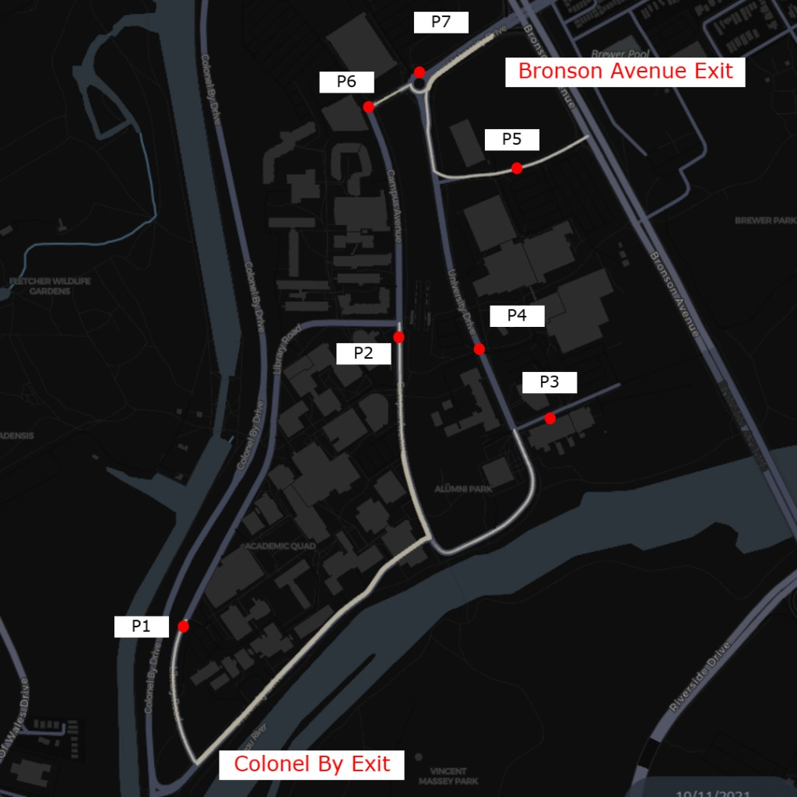

# SOHCarletonDrivingBox

Car evacuation on the Carleton campus drive network. Cars spawn from parking lots P1–P7 on a schedule, route on `resources/campus_drive_graph.geojson`, and exit at configured destinations.



Parking lots **P1–P7** and the two main exits: **Colonel By** (south-west) and **Bronson Avenue** (north-east). Scenario 07 uses an additional emergency exit at Bronson Ave & Raven Rd for P3 and P4. Scenario 09 blocks the main Bronson exit and splits traffic between Colonel By (P1/P2) and the Raven emergency exit (P3/P4/P5/P6/P7). Scenario 10 keeps baseline timing and the base graph, but sends P6 to Colonel By instead of Bronson.

---

## ModelDescription

In `Program.cs`, a `ModelDescription` registers the campus-specific agent and layers:

```csharp
var description = new ModelDescription();
description.AddLayer<CarletonCarLayer>("CarLayer");
description.AddAgent<CarletonCarDriver, CarletonCarLayer>();
description.AddEntity<Car>();
description.AddLayer<CarletonCarDriverSchedulerLayer>();
```

| Type | Role |
|------|------|
| `CarletonCarLayer` | Drive graph layer (extends stock `CarLayer`) |
| `CarletonCarDriver` | Car agent for this box (extends stock `CarDriver` behaviour with campus spawn/routing fixes) |
| `CarletonCarDriverSchedulerLayer` | Spawns drivers from a schedule CSV (`startLat`/`startLon`/`destLat`/`destLon`) |
| `Car` | Vehicle entity |

**Why a separate driver type?** Stock `CarDriver` in `SOHModel` is unchanged so other boxes (e.g. `SOHTravellingBox`) keep working. Campus-specific behaviour lives in `CarletonCarDriver.cs` in this project only.

Agent and layer names in the JSON config must match the types above.

---

## Scenarios

Each variant has its own config under `configs/`:

| Config | Description |
|--------|-------------|
| `configs/config_scenario_01.json` | Baseline — all lots deploy at simulation start |
| `configs/config_scenario_02.json` | P6 delayed 1 h |
| `configs/config_scenario_03.json` | P6 delayed 2 h |
| `configs/config_scenario_04.json` | P3 delayed 1 h, P6 delayed 2 h |
| `configs/config_scenario_05.json` | P3 + P4 delayed 1 h, P6 delayed 2 h |
| `configs/config_scenario_06.json` | P3 + P4 delayed 1 h, P6 delayed 1.5 h |
| `configs/config_scenario_07.json` | Baseline timing; alternate graph and P3/P4 exit |
| `configs/config_scenario_08.json` | Baseline timing; Bronson exit blocked; all lots → Colonel By |
| `configs/config_scenario_09.json` | Baseline timing; Bronson blocked + Raven emergency; P1/P2 → Colonel By, P3/P4/P5/P6/P7 → emergency |
| `configs/config_scenario_10.json` | Baseline timing; base graph; P6 → Colonel By (P1–P3 Colonel By, P4/P5/P7 Bronson) |

`config.json` at the project root is a shortcut for scenario 01 (same as `configs/config_scenario_01.json`, writes to `results/scenario_01/`).

Example config layout:

```json
{
  "globals": {
    "startPoint": "2021-10-11T06:00:00",
    "endPoint": "2021-10-11T10:01:00",
    "csvOptions": { "outputPath": "results/scenario_01" }
  },
  "agents": [{ "name": "CarletonCarDriver", "count": 3300 }],
  "layers": [
    { "name": "CarLayer", "file": "resources/campus_drive_graph.geojson" },
    { "name": "CarletonCarDriverSchedulerLayer", "file": "resources/schedules/scenario_01_schedule.csv" }
  ],
  "entities": [{ "name": "Car", "file": "resources/car.csv" }]
}
```

The schedule file belongs on **`CarletonCarDriverSchedulerLayer`**, not on the agent.

---

## Resources

| Path | Role |
|------|------|
| `resources/campus_drive_graph.geojson` | Drive network (scenarios 01–06, 10) |
| `resources/campus_drive_graph_scenario_07.geojson` | Drive network for scenario 07 |
| `resources/campus_drive_graph_scenario_08.geojson` | Drive network for scenario 08 (Bronson exits removed) |
| `resources/campus_drive_graph_scenario_09.geojson` | Drive network for scenario 09 (Bronson blocked + Raven emergency link) |
| `resources/schedules/scenario_XX_schedule.csv` | Spawn windows and coordinates per lot |
| `resources/schedule_base.csv` | Lot deploy windows and coordinates for scenarios 01–06 |
| `resources/schedule_base_07.csv` | Lot deploy windows and coordinates for scenario 07 |
| `resources/schedule_base_08.csv` | Lot deploy windows and coordinates for scenario 08 |
| `resources/schedule_base_09.csv` | Lot deploy windows and coordinates for scenario 09 |
| `resources/schedule_base_10.csv` | Lot deploy windows and coordinates for scenario 10 |
| `resources/parking_lot_schedules/scenario_XX.csv` | Per-lot delay offsets (`initEventInSec`) |
| `resources/car.csv` | Car entity parameters |
| `resources/sim_road_lengths.csv` | Road segment lengths (heatmap scripts) |

---

## Outputs

Per-scenario results are written to the folder set in `globals.csvOptions.outputPath` (e.g. `results/scenario_01/`):

| File | Content |
|------|---------|
| `CarletonCarDriver.csv` | Per-tick agent state |
| `CarletonCarDriver_trips.geojson` | Completed trip geometries |

---

## Post-run analysis (optional)

### Interactive notebook

`analyze_scenario.ipynb` — pick scenario 1–10, optionally run the simulation, then view summary charts. A DEVS comparison section is stubbed for later.

```bash
python3 -m venv .venv
source .venv/bin/activate          # Windows: .venv\Scripts\activate
pip install -r requirements.txt
python -m ipykernel install --user --name=carleton-driving --display-name="Carleton Driving"
jupyter notebook analyze_scenario.ipynb
```

Set `SCENARIO = 7` and `RUN_SIMULATION = True` (or `False` to only re-analyze existing `results/scenario_XX/` output).

### Scripts

Python 3 scripts under `scripts/`:

| Script | Purpose |
|--------|---------|
| `scripts/analyze_run.py` | Summary stats and evacuation curve for one scenario |
| `scripts/analyze_all_scenarios.py` | Same for all scenarios 01–10 |
| `scripts/analyze_and_heatmap.py` | Analyze + heatmap matrix + plot for one scenario |
| `scripts/build_heatmap_matrix.py` | Road occupancy matrix only |
| `scripts/plot_heatmap.py` | Heatmap image only |
| `scripts/plot_agent_routes.py` | Per-trip route maps (`python scripts/plot_agent_routes.py 01`) |
| `scripts/run_all_scenarios.py` | Run simulations 01–10 (`python scripts/run_all_scenarios.py`) |

Pass the path to `CarletonCarDriver.csv` where a script accepts a file argument; trips geojson is resolved from the same folder.

---

## Key files

| Path | Role |
|------|------|
| `CarletonCarDriver.cs` | Campus car agent |
| `CarletonCarLayer.cs` | Campus car layer |
| `CarletonCarDriverSchedulerLayer.cs` | Schedule-based spawning |
| `Program.cs` | Model registration and startup |
| `configs/config_scenario_*.json` | One config per scenario variant |

For more on MARS/SOH configuration, see [mars.haw-hamburg.de](https://mars.haw-hamburg.de).
