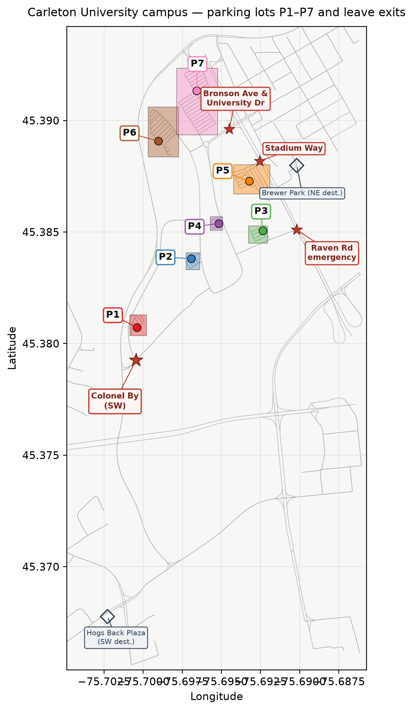
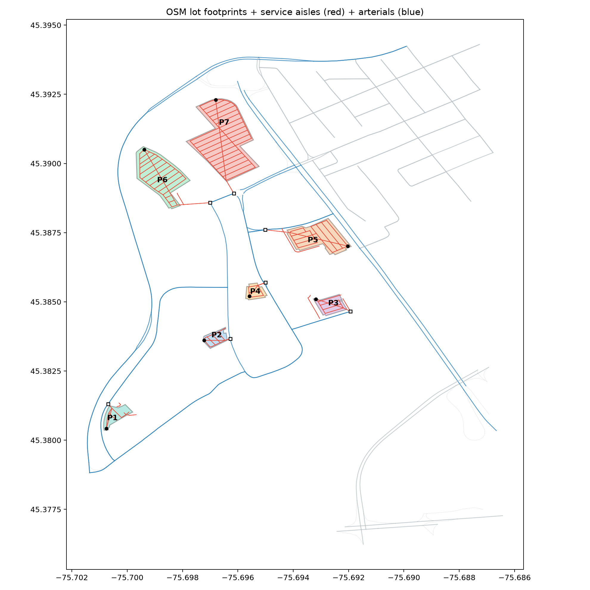

# Carleton campus car evacuation (MARS)

This project simulates cars leaving Carleton University during an evacuation.

Cars start in parking lots **P1-P7**. They drive on the campus road network (GeoJSON files under `resources/`). There are **four** campus exits:

1. **Colonel By** - southwest campus gate (University Dr → off-campus toward Hogs Back Plaza)
2. **Bronson Ave & University Dr** - northeast main exit
3. **Stadium Way** - northeast via Stadium Way @ Bronson
4. **Raven Rd emergency** - Raven-Bronson link (only in scenarios **07** and **09**)

Which exits are open depends on the scenario (for example, **08** closes Bronson & University Dr; **07**/**09** open the emergency link).

Off-campus routing sinks (not clearance gates): **Hogs Back Plaza** (SW, 888 Meadowlands Dr) and **Brewer Park** (NE). Evacuation clearance is when cars leave campus at a gate, not when they arrive at a plaza.





Regenerate the Methods map with:

```bash
python3 scripts/plot_campus_lots_and_exits.py
```

The older GitHub screenshot (`docs/campus_parking_lots.png`) only marked two exits and is superseded by the figure above.

---

## Preferred way to test: Jupyter notebook

The easiest way to run and inspect a scenario is the notebook `analyze_scenario.ipynb`.

1. Install .NET and the parent `SOHModel` package (needed if you run a simulation from the notebook).
2. Set up Python once from this folder:

```bash
python3 -m venv .venv
source .venv/bin/activate
pip install -r requirements.txt
python3 -m ipykernel install --user --name=carleton-driving --display-name="Carleton Driving"
```

3. Open the notebook:

```bash
jupyter notebook analyze_scenario.ipynb
```

4. In the first cells, set:
   - `SCENARIO` - scenario number `1`-`12`
   - `RUN_SIMULATION` - `True` to run the sim, or `False` to only analyze existing results under `results/scenario_XX/`
   - Optionally turn on analysis and/or heatmap steps as the notebook describes

Then run the cells in order. Charts and summaries appear in the notebook; files are written under `results/scenario_XX/`.

---

## Scenarios 01-12

Hand-tuned baselines and variants. Configs: `configs/config_scenario_01.json` … `config_scenario_12.json`.

`config.json` at the project root is a shortcut for scenario 01.

| Config | What it does |
|--------|--------------|
| 01 | Everyone starts at 06:00. P1/P2 → SW. P3-P7 → NE |
| 02 | P6 starts 1 hour late |
| 03 | P6 starts 2 hours late |
| 04 | P3 delayed 1 h; P6 delayed 2 h |
| 05 | P3+P4 delayed 1 h; P6 delayed 2 h |
| 06 | P3+P4 delayed 1 h; P6 delayed 1.5 h |
| 07 | Same timing as baseline; alternate map + Raven exit for P3/P4 |
| 08 | Bronson & University Dr blocked; P1/P2 → SW; P3-P7 → Brewer Park |
| 09 | Same as 08, plus Raven-Bronson emergency open |
| 10 | Base map; P1/P2/P6 → SW; P3-P5/P7 → Brewer Park |
| 11 | Same as 01, except P7 split 550 → Brewer (NE) + 550 → Hogs Back Plaza (SW). All lots still start at 06:01; P5 stays Brewer |
| 12 | Same as 10 (P6 → Hogs Back Plaza/SW), except P7 split 550 → Brewer (NE) + 550 → Hogs Back Plaza (SW). All lots early one-shot 06:01 |

Spawn times come from schedule CSV files on the **`CarletonCarDriverSchedulerLayer`** (not on the car agent). Example config:

```json
{
  "globals": {
    "startPoint": "2021-10-11T06:00:00",
    "endPoint": "2021-10-11T10:01:00",
    "csvOptions": { "outputPath": "results/scenario_01" }
  },
  "agents": [{ "name": "CarletonCarDriver", "count": 3300 }],
  "layers": [
    { "name": "CarLayer", "file": "resources/campus_drive_graph.geojson" },
    { "name": "CarletonCarDriverSchedulerLayer", "file": "resources/schedules/scenario_01_schedule.csv" }
  ],
  "entities": [{ "name": "Car", "file": "resources/car.csv" }]
}
```

---

## Feedback optimizer (closed loop)

`scripts/optimize_evac_feedback.py` proposes lot→exit destinations and start times, runs MARS, analyzes clearance, then mutates toward better full-campus clear times. Details: `docs/evac_route_optimization.md`.

From `CarletonDrivingBox/` (activate `.venv` if you use it):

```bash
# Overnight closed loop
python scripts/optimize_evac_feedback.py --iterations 20 --horizon 14400

# Continue from published / local leaderboard best
python scripts/optimize_evac_feedback.py --iterations 10 --resume --seed best

# Wiring test only (no MARS)
python scripts/optimize_evac_feedback.py --dry-run --iterations 8 --rng-seed 1
```

Artifacts:

| Path | Role |
|------|------|
| `results/fb_candidates/leaderboard.csv` | Ranked scores (`evac_end_s` when cleared) |
| `results/fb_candidates/history.jsonl` | Iteration audit trail |
| `results/fb_candidates/fb_*/` | Per-candidate sim + analysis (heavy files local-only) |
| `configs/fb_candidates/` / `resources/schedules/fb_candidates/` | Generated configs/schedules |

### Published overnight best (in this repo)

- **Name:** `fb_MBBBMMB_0030201`
- **Clearance:** `evac_end_s` ≈ **7045** s (campus cleared)
- **Destinations:** P1=M, P2=B, P3=B, P4=B, P5=M, P6=M, P7=B
- **Starts:** P1/P2/P4/P6 @ 06:01; P7 @ 06:30; P5 @ 07:00; P3 @ 07:30
- Lean folder: `results/fb_candidates/fb_MBBBMMB_0030201/` (`metrics.json`, summary plots/CSVs)
- Config/schedule: `configs/fb_candidates/config_fb_MBBBMMB_0030201.json`, `resources/schedules/fb_candidates/fb_MBBBMMB_0030201_schedule.csv`

Do not overwrite scenarios 01-12 with optimizer winners until a candidate beats scenario 12 in a full sim.

Legacy fraction-proxy tool: `scripts/optimize_exit_assignment.py` (see `docs/evac_route_optimization.md`).

---

## Build and run (command line)

You can also run the simulator directly without the notebook. You need .NET and the parent `SOHModel` package. From this folder:

```bash
dotnet build SOHCarletonDrivingBox.csproj
dotnet run --project SOHCarletonDrivingBox.csproj -- configs/config_scenario_01.json
```

Run all scenarios 01-12:

```bash
python3 scripts/run_all_scenarios.py
```

Overnight re-sim + analyze/heatmap + one agent route per lot (02–12):

```bash
python scripts/rerun_scenarios_02_12.py
```

Results go to `results/scenario_XX/`. Main files (local-only / gitignored):

- `CarletonCarDriver.csv`
- `CarletonCarDriver_trips.geojson`

Names in the config must match the registered types: `CarletonCarLayer` (as `"CarLayer"`), `CarletonCarDriver`, `CarletonCarDriverSchedulerLayer`, and `Car`.

---

## Analysis and heatmaps (command line)

Activate the same Python environment as above (`source .venv/bin/activate`), then:

| Script | What it does |
|--------|--------------|
| `scripts/analyze_run.py` | Summary and evacuation curve for one run |
| `scripts/analyze_all_scenarios.py` | Analyze scenarios 01-12 |
| `scripts/analyze_and_heatmap.py` | Analyze, build matrix, and plot heatmap |
| `scripts/build_heatmap_matrix.py` | Road occupancy over time (`--dt 10` by default) |
| `scripts/plot_heatmap.py` | Heatmap PNG (percentile scale by default; `--comparable` uses fixed vmax=20) |
| `scripts/plot_agent_routes.py` | Map of each trip's route |
| `scripts/run_all_scenarios.py` | Run simulations 01-12 |
| `scripts/rerun_scenarios_02_12.py` | Overnight: re-sim 02–12 + analyze/heatmap + one route per lot |
| `scripts/optimize_evac_feedback.py` | Closed-loop clearance search |

Examples:

```bash
python3 scripts/analyze_and_heatmap.py results/scenario_01/CarletonCarDriver.csv
python3 scripts/plot_heatmap.py results/scenario_01/heatmap_matrix.csv
python3 scripts/plot_heatmap.py results/scenario_01/heatmap_matrix.csv --comparable
python scripts/rerun_scenarios_02_12.py
```

---

## Key paths

| Path | Role |
|------|------|
| `resources/campus_drive_graph.geojson` | Road network for scenarios 01-06, 10, 11, and 12 |
| `resources/campus_drive_graph_scenario_07.geojson` | Road network for scenario 07 |
| `resources/campus_drive_graph_scenario_08.geojson` | Road network for scenario 08 |
| `resources/campus_drive_graph_scenario_09.geojson` | Road network for scenario 09 |
| `resources/schedules/scenario_XX_schedule.csv` | When cars spawn in each scenario |
| `resources/parking_lot_spawns.csv` | Spawn points and box bounds |
| `resources/parking_lot_spawn_candidates.json` | Interior aisle nodes |
| `resources/sim_road_lengths.csv` | Corridor lengths (used for heatmaps) |
| `resources/car.csv` | Car parameters |
| `CarletonCarDriver.cs` / `CarletonCarLayer.cs` / `CarletonCarDriverSchedulerLayer.cs` | Local agent and layer code |
| `Program.cs` | Registers model types |
| `analyze_scenario.ipynb` | Preferred notebook for testing |
| `results/fb_candidates/leaderboard.csv` | Feedback optimizer leaderboard |

MARS docs: [mars.haw-hamburg.de](https://mars.haw-hamburg.de)