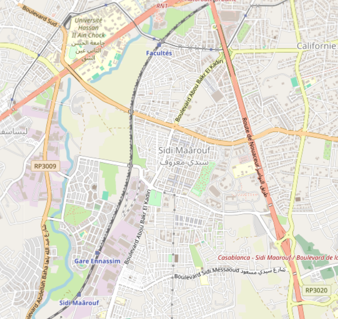

# CasablancaBox 🚍

Casablanca citizens simulation that runs the SOH model in four modes:
> * **Bus** – `BusDriver` + `PassengerTraveler` on `CarDriving` + `Walking` graphs
> * **Tram** – `TramDriver` + `PassengerTraveler` on `Tram` track + `Walking` 
> * **Bicycle** – `CycleTraveler` on `Cycling` graphs
> * **Walk** – `HumanTraveler`s on `Walking` only

You can pick a `config_*.json` per mode and validates that the required graph modalities are present before the simulation starts.

---
## Area of Interest
The following image illustrate the area of interst that was chosen for the scenario.


## Active Agents and Entities

| Agent or Entity       | Responsibility                                                                                                                                                     |
|-----------------------|--------------------------------------------------------------------------------------------------------------------------------------------------------------------|
| ``Citizen``           | Models an individual citizen’s daily life, making mobility decisions (home, work, errands, free time) and moving through the environment via multimodal transport. |
| ``TramDriver``&&``BusDriver``      | Agent operating a single Tram/Bus, moving it between stations according to TramRouteLayer schedules.                                                               |
| ``HumanTraveler``     | Represents a general traveler with access to multiple transport modes and probabilistic preferences.                                                               |
| ``CycleTraveler``     | Represents an individual cycling/walking traveler, capable of switching between own/rental bikes and walking.                                                      |
| ``PassengerTraveler`` | Represents a passenger traveler restricted to bus/tram modalities.                                                                                                 |
| ``Bus``               | Models a bus as a road-based vehicle, connected to its operating layer (BusLayer), aware of stations, and supporting passenger and steering interactions.          |
| ``Bicycle``           | Models the physical and functional aspects of a bicycle in the multimodal environment, including weight, type, mass, and integration with parking and steering.    |
| ``Tram``              | Models a tram as a rail-bound, non-colliding vehicle in the multimodal simulation, integrated with stations, steering, and passenger management.                   |

##  Active Layers

| Layer                                         | Responsibility                                                                                                                                                                  |
|-----------------------------------------------|---------------------------------------------------------------------------------------------------------------------------------------------------------------------------------|
| ``SpatialGraphMediatorLayer``                 | A multimodal, lane-resolved spatial graph layer enabling agent traversal across edge lanes under modality-specific constraints.                                                 |
| ``VectorBuildingsLayer``                      | A vector layer containing building Polygon/MultiPolygon geometries annotated with service types, enabling mapping to TripReason activities.                                     |
| ``VectorPoiLayer``                            | A vector layer of Point geometries for relevant services, enabling mapping to TripReason activities.                                                                            |
| ``VectorLandUseLayer``                        | A vector layer containing Polygon/MultiPolygon geometries that represent service areas, enabling mapping to TripReason activities.                                              |
| ``MediatorLayer``                             | An aggregating layer wrapping multiple vector layers, such as VectorPoiLayer, enabling the retrieval of subsequent travel goals conditioned on a specified TripReason activity. |
| ``TramLayer``&&``BusLayer``                   | Manages trams/busses (drivers) within the spatial environment and connects them to the route layer.                                                                             |
| ``TramSchedulerLayer``&&``BusSchedulerLayer`` | Responsible for time-based scheduling and deployment of trams into the simulation, linked with the TramLayer.                                                                   |
| ``TramStationLayer``&&``BusStationLayer``     | Manages tram/bus station data and enables querying stations spatially or by ID.                                                                                                 |
| ``TramRouteLayer`` && ``BusRouteLayer``                        | Organizes tram/bus routes, connects them to stations, and provides lookup and management for routing.                                                                           |
| ``CitizenLayer``                              | Holds and manages all citizens as simulation agents, wiring them with dependencies for multimodal decision-making.                                                              |
| ``CitizenSchedulerLayer``                     | Schedules and spawns citizens into the simulation with attributes and starting positions, according to timetable and input data.                                                |
| ``PassengerTravelerLayer``                    | Provides environment and initialization logic for passenger travelers.                                                                                                          |
| ``HumanTravelerLayer``                        | Provides the environment for human travelers with diverse modality options.                                                                                                     |
| ``CycleTravelerLayer``                        | Provides the environment and routing context for cycle travelers.                                                                                                               |
| ``CycleTravelerSchedulerLayer``               | Introduces cycle travelers into the simulation based on schedule/timetable data.                                                                                                |
## Requirements
* .NET SDK 8.0+
* The SOHModel project available and referenced.
* GeoJSON/CSV resources under a `resources/` directory (see structure below).
* **Legacy GTFS 1.7.1 NuGet package**: If you keep this package, it will emit an `NU1701` warning because it targets .NET Framework. Remove it if you don’t use GTFS, or suppress the warning.

---
## Project Layout
Coming Soon

Warning: Ensure all resources and configs are copied to the build output by adding this to your CasablancaBox.csproj!

---

## Build
```bash
dotnet build
```
## Running the model
```bash
dotnet run
```
## Data Preparation Scripts
The required geospatial datasets for the simulation were generated with the scripts provided under `Casablanca/resources/scripts`
| File                                      | Responsibility                                                   |
|-------------------------------------------|------------------------------------------------------------------|
| ``generate_landuse_and_buildings.py``             | Produces vector layers of land use and building data as GeoJSON. |
| ``generate_POI.py``                  | Extracts Points of Interest (POIs) for an AOI.                   |
| ``generate_drive_walk_graphs.py``                  | Builds driving and walking network graphs for Casablanca Sidi Maârouf.                  |
| ``extract_tram_stations.py``                  | Creates a tram station layer from OSM data.                   |
| ``generate_random_points_in_aoi.py``                   | Generates random points inside an AOI polygon with optional spacing.                   |
| ``generate_GraphML.py``                  | Exports AOI’s networks as GraphML files for compatibility with graph-based tools.                   |
| ``extract_bus_routes_and_stations.py``                     | Extracts bus routes and stations from OSM Overpass API for a given AOI.                  |

## Visualization
The agents' movement throughout a simulation can be visualized in kepler.gl.
The static resources like the routes or the stations can be added from the \resources folder by into kepler.gl via drag-and-drop.
Additionally, the *_trips.geojson can be added to visualize the agents' movement and interactions over time
## Possible Extensions
Coming Soon
