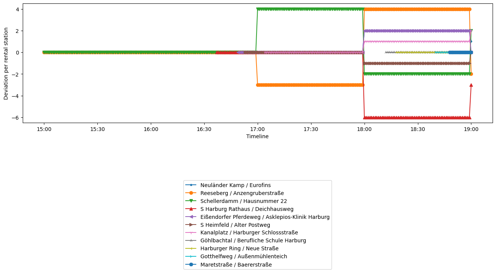

# BicycleRealtimeBox

`BicycleRealtimeBox` is model integrating sensor data for internal model correction of bicycle rental stations. Moving agents in the area of Hamburg Harburg `Env[9.9354367 : 10.0275171, 53.4219923 : 53.4700337]` uses these stations in order to walk or cycle towards a target.

## Starting

Download the model from the [Releases](https://github.com/MARS-Group-HAW/model-soh-bicyclerealtime/releases) for your operating system and run it directly from the terminal.

```bash
./SOHBicycleRealtimeBox --sm config.json
```

Make sure that the default scenario described in the `config.json`, is available in the current directory where you start the box.

The system creates an output folder `results` in which states of the `BicycleRentalLayer ` anchored in the model, are persisted for the respective simulation times.

## Configure

The starting point of the box is the scenario in the supplied `config.json`. The config allows changing various settings such as time periods, number of synchronizations or the frequency of the output and execution.
For example, to set the synchronization times, meaning the time-points when a correction shall be applied can be added or changed in the section `synchronization` of the `BicycleRentalLayer` mapping:

````json
{
  "name": "synchronizations",
  "value": [
    "2020-12-17T17:00:00",
    "2020-12-17T18:00:00",
    "2020-12-17T19:00:00"
  ]
}
````

You can find more information about this [here](https://www.mars-group.org/docs/tutorial/configuration/sim_config_options).

## Analyze 

The results of the CSV can be directly analyzed and visualized with a preferred GIS tool. Alternatively, the `chart.py` is a customized Python script to visualize the deviation of the model state from the real state at different simulation times.

To use the script we recommend installing `python3.8` or higher in advance. In addition, install necessary dependencies of the script as follows:

```bash
pip3 install -r requirements.txt
```

The call installs `pandas` and `matplotlib` as necessary dependencies.

Then start the script by issuing the following command with parameter `-f` targeting the path of result file `BicycleRentalLayer.csv`:

```bash
python3 chart.py -f results/BicycleRentalLayer.csv
```

This call creates a plot showing the difference for each synchronization point, coming from the config:


