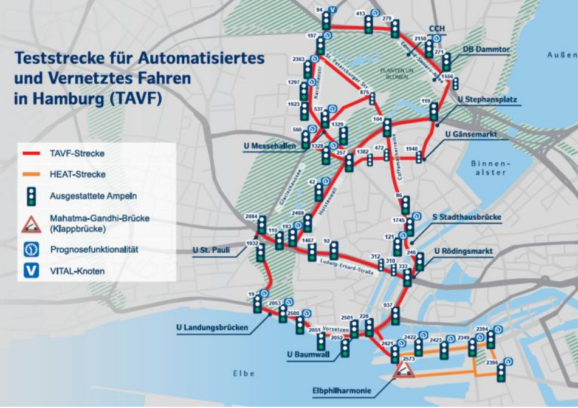

# SOHC-ITSBox

## Gliederung

- [Projekt: Smart-Open-Hamburg Cooperative Intelligent Transport Systems](#projekt:-smart-open-hamburg-cooperative-intelligent-transport-systems)
  - [Übersicht und Ziele](#übersicht-und-ziele)
    - [Was ist ein C-ITS](#was-ist-ein-c-its)
  - [ModelDescription](#modeldescription)
  - [Globals](#globals)
  - [Layer Mappings](#layer-mappings)
  - [AgentMappings](#agentmappings)

## Projekt: Smart-Open-Hamburg Cooperative Intelligent Transport Systems

**Projekt-Mitglieder**  
- Marin Grez, Ruben
- Karimy, Paiman
- Karrar, Abdol-Rahman Isam

### Übersicht and Ziele

#### Was ist ein C-ITS?

Ein kooperatives intelligentes Transportsystem (C-ITS) erweitert das Konzept der intelligenten Transportsysteme, indem es die Kommunikation zwischen Fahrzeugen, Infrastruktur und anderen Verkehrsteilnehmern ermöglicht. Diese Zusammenarbeit verbessert die Gesamteffizienz und Sicherheit des Transportsystems.

Derzeit wird in Hamburg ein Prototyp eines kooperativen intelligenten Transportsystems (C-ITS) entwickelt. Es bleibt jedoch unklar, wie sich Funktionen wie automatische Ampelphasenänderungen bei Annäherung von Bussen und Einsatzfahrzeugen (Polizei und Krankenwagen) auf den Stadtverkehr auswirken.

**Testgebiet**  
  
Unsere Simulation befasst sich mit der *TAVF-Teststrecke* (in Rot eingezeichnet).

**Ziel**

Das Ziel dieses Projekts ist es, die notwendigen Elemente zum Smart Open Hansestadt Hamburg (SOHH) Projekt hinzuzufügen, um eine Studie durch Simulationen durchzuführen.  
Dabei liegt unser Fokus auf den Dienst **Traffic Signal Priority Request** kurz **TSP**. 
**TSP** bietet den Dienst an, das Fahrzeuge mit hoher Priorität die Ampelphasen so verändern können, sodass sie sich schneller im Verkehr fortbewegen können.  

Dadurch werden folgende Punkte erreicht:  

- Verkürzung der Reaktionszeiten, im Falle wenn ein Einsatzfahrzeug durch den Verkehr möchte
- Erhöhung der Verkehrssicherheit
- Busse erreichen ihre Haltestellen schneller

## Datenakquisition  
**Schritt 1: Area-of-Interest und StreetNetwork-Graph des Testgebiets erstellen**  
Um unsere AOI sowie den StreetNetwork-Graph in Form einer geojson-Datei festzulegen, befolgten wir die Anleitung aus dem blueprint-geovector Repository.
Die Area-Of-Interest wird mittels einem Well-Known Text (WKT) geometry file, in der sich 5 Koordinaten eines Polygons
(welche die Eckpunkte beschreiben) befinden, definiert.  
Der StreetNetwork-Graph (geojson-Datei) wurde mittels der WKT-Datei und Daten aus Open-Street-Map (OSM) generiert.  

Siehe Repo [blueprint-geovector](https://github.com/MARS-Group-HAW/blueprint-geovector) im README, Kapitel [*How to Use the Notebooks and Model*](https://github.com/MARS-Group-HAW/blueprint-geovector?tab=readme-ov-file#how-to-use-the-notebooks-and-model) Abschnitt 1 und 2.

Diese geojson-Datei wird für das CarLayer verwendet und liefert den Autos die Fahrstrecke.
Hier heißt sie `c_its_teststrecke_street_graph.geojson` und wird in `config.json` eingebunden.

**Schritt 2: Erhebung der Ampelkoordinaten**  
Für die Erhebung der Ampelkoordinaten aus unserem Testgebiet, ist das Script `scripts/fetch_traffic_lights.py`
verantwortlich. 
Zuerst müssen alle Koordianten der Ampeln aus dem Area of Interest aus Schritt 1 gefunden werden.
Dieses Script sucht und fetched aus der API 'https://tld.iot.hamburg.de/v1.0/Datastreams' aus allen Ampeln (aus Hamburg), die Ampeln aus dem Gebiet für das man sich interessiert. Füge dafür in die Variable polygon_coords die 5 Koordinaten aus dem Polygon aus Schritt 1 ein.

Das Ergebnis steht in `traffic_lights_observations.json`. 
Um nur Koordianten daraus zu extrahieren verwende das Script `generate_csv.py`.
Der Output `traffic_lights_observations.csv` enthällt jetzt nur die Ampel-Koordinaten aus dem Area of Interest.

Für weitere Informationen zur API siehe
`./doc/Realtime_Traffic_Lights_Data_Hamburg_API.pdf`

**Schritt 3: Erhebung der Ampel-Phasen**  
Die aufgezeichneten Live-Ampel-Phasen zu den jeweiligen Ampeln müssen auch aus traffic_lights_observations.json extrahiert werden.
Dazu verwendet man das Script traffic_light_phase_parser.py. Um es auszuführen, verwendet man als 1. Parameter die traffic_lights_observations.json. Der 2. Parameter ist der Name der Output Datei und muss mit .json enden.

Als Ergebnis bekommt man die Ampelphasen für jede Sekunde pro Ampel. Eine Sekunde entspricht ein Tick im Programm.

Beispiel:
"((9.9839458, 53.5556457), (9.9843108, 53.555496))": [
        3,
        3,
        3,
        3,
        3,
        1,
        1,
        1,
        ...
]

Die beiden Ampeln an den Koordianten (9.9839458, 53.5556457) und (9.9843108, 53.555496) sind in den ersten 5 Sekunden grün geschaltet. Das sieht man daran, dass in den ersten fünf Zeilen eine 3 ist. Jede Zeile ist der Zustand einer Ampel pro Sekunde. In dem Beispiel oben ist die Ampel in Sekunde 6, 7 und 8 auf rot geschaltet, weil in der Zeile 6,7 und 8 die 1 steht.

Für weitere Informationen zu den Ampelphasen siehe hier unter 'Ampelphasen': `.doc/Realtime_Traffic_Lights_Data_Hamburg_API.pdf`

## ModelDescription

This section should describe the model used in the project, including its components and how they interact.

## Globals  
This section should list and describe any global variables or settings used throughout the project.

## Layer Mappings
This section should explain the mappings between different layers in the project, detailing how data flows between them.

## AgentMappings
This section should describe the mappings for different agents within the project, including their roles and interactions.

## Parametrisierungsanleitung

**Anzahl Emergency cars ändern**

Um die Anzahl der Emergency cars zu verändern muss in config.json der count geändert werden. Außerdem muss man in der Datei resources/emergency_car_driver.csv entsprechend neue emergency cars eingefügen, bzw. entfernen.

**Zeitspanne zum fetchen der Ampelphasen ändern**

Aktuell werden die Ampalephasen der letzen 15 Minuten mit dem Script `fetch_traffic_lights.py` gefetched. Um dies zu ändern muss man in der folgender URL `top` anpassen sowie `skip` variabel durch eine Schleifen-Index bestimmen:

<https://tld.iot.hamburg.de/v1.0/Datastreams?$filter=properties/serviceName%eq%'HH_STA_traffic_lights'%and%properties/layerName%eq%'primary_signal'&$expand=Observations($orderby=phenomenonTime%desc;$top=15)&$orderby=id&$top=1000&$skip={skip}>

Erhöhe beipsielsweise `top` auf 30, um ungefähr die letzen 30 Minuten zu fetchen.

## Mögliche Erweiterungen

**gefetchte Live-Ampelphasen ins Programm einbinden**

Die Live-Ampelphasen können erfolgreich gefetched werden. Außerdem können sie in ein Format umgewandelt werden, in dem die Ampelphasen jeder Ampel pro Sekunde (pro Tick) angezeigt werden (siehe bei Datenakquisition, Live Ampel-Phasen).

In einer nächste Erweiterung, soll das Programm diese Live-Ampelphasen nutzen. Das würde die Simulation realistischer machen.

Mögliche Implementierung:
Der traffic_light_controller bekommt die Live-Ampelphasen als Parameter und nutzt diese dann. Dabei sollte beachtet werden, dass jeder Controller die passenden Zeiten zu der richtigen Ampel bekommt.

**Busse und Polizeiautos können priority requests schicken**

Aktuell können Emergency cars erstellt werden, die priority-requests an die Ampeln schicken können. Das kann noch auf Busse und Polizeiautos erweitert werden.

