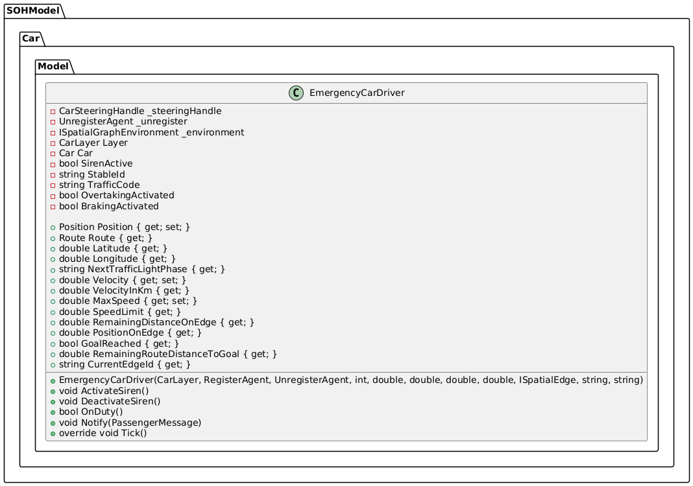
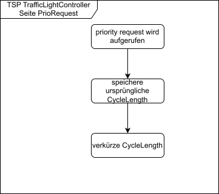

# SOHCooperateTransportSystemBox

## Outline

- [Project: Smart-Open-Hamburg Cooperative Intelligent Transport Systems](#project-smart-open-hamburg-cooperative-intelligent-transport-systems)
  - [Overview and Objectives](#overview-and-objectives)
    - [What is a C-ITS?](#what-is-a-c-its)
    - [Test Area](#test-area)
    - [Objective](#objective)
  - [Data Acquisition](#data-acquisition)
    - [Step 1: Creating the Area of Interest and Street Network Graph of the Test Area](#step-1-creating-the-area-of-interest-and-street-network-graph-of-the-test-area)
    - [Step 2: Collecting Traffic Light Coordinates](#step-2-collecting-traffic-light-coordinates)
    - [Step 3: Collecting Traffic Light Phases](#step-3-collecting-traffic-light-phases)
  - [Parameterization Guide](#parameterization-guide)
    - [Changing the Number of Emergency Cars](#changing-the-number-of-emergency-cars)
    - [Changing the Time Span for Fetching Traffic Light Phases](#changing-the-time-span-for-fetching-traffic-light-phases)
  - [Design Overview](#design-overview)
    - [Implementation of TSP](#implementation-of-tsp)
  - [Evaluation and Visualization Guide](#evaluation-and-visualization-guide)
    - [Performing the Evaluation](#performing-the-evaluation)
    - [Visualization](#visualization)
  - [Possible Extensions](#possible-extensions)
    - [Integrating Fetched Live Traffic Light Phases into the Program](#integrating-fetched-live-traffic-light-phases-into-the-program)
    - [Buses and Police Cars Sending Priority Requests](#buses-and-police-cars-sending-priority-requests)

## Project: Smart-Open-Hamburg Cooperative Intelligent Transport Systems

**Project Members**

- Marin Grez, Ruben
- Karimy, Paiman
- Karrar, Abdol-Rahman Isam

### Overview and Objectives

#### What is a C-ITS?

A Cooperative Intelligent Transport System (C-ITS) extends the concept of Intelligent Transport Systems by enabling communication between vehicles, infrastructure, and other road users. This collaboration improves the overall efficiency and safety of the transport system.

Currently, a prototype of a cooperative intelligent transport system (C-ITS) is being developed in Hamburg. However, it remains unclear how functions like automatic traffic light phase changes triggered by approaching buses and emergency vehicles (police and ambulances) affect city traffic.

### Test Area


Our simulation focuses on the *TAVF test track* (highlighted in red).

### Objective

The goal of this project is to add the necessary components to the Smart Open Hanseatic City Hamburg (SOHH) project to conduct a study through simulations.
Our focus is on the **Traffic Signal Priority Request** service, abbreviated as **TSP**.

The core idea is that emergency vehicles, buses, etc., should be able to request prioritized treatment at traffic lights, resulting in temporarily altered traffic light cycles. This ensures that these vehicles get a green light faster and can reach their destinations more quickly.

This achieves the following:

- Shorter response times for emergency vehicles navigating traffic
- Increased traffic safety
- Faster arrival of buses at their stops

## Data Acquisition

### Step 1: Creating the Area of Interest and Street Network Graph of the Test Area

To define our Area of Interest (AOI) and the Street Network Graph as a GeoJSON file, we followed the instructions from the `blueprint-geovector` repository.

The AOI is defined using a Well-Known Text (WKT) geometry file, which contains the coordinates of a polygon's five vertices.
The Street Network Graph (GeoJSON file) was generated using the WKT file and data from OpenStreetMap (OSM).

See the `blueprint-geovector` repo [here](https://github.com/MARS-Group-HAW/blueprint-geovector) and refer to the README sections [*How to Use the Notebooks and Model*](https://github.com/MARS-Group-HAW/blueprint-geovector?tab=readme-ov-file#how-to-use-the-notebooks-and-model), sections 1 and 2.

This GeoJSON file is used for the CarLayer and provides the routes for cars. It is named `c_its_teststrecke_street_graph.geojson` and is referenced in `config.json`.

### Step 2: Collecting Traffic Light Coordinates

The script `scripts/fetch_traffic_lights.py` is responsible for collecting traffic light coordinates from our test area.
First, all traffic light coordinates in the AOI (from Step 1) must be identified. This script fetches traffic lights from the API `https://tld.iot.hamburg.de/v1.0/Datastreams`, filtering for traffic lights within the specified AOI polygon coordinates.

The result is stored in `traffic_lights_observations.json`. To extract just the coordinates, use the `generate_csv.py` script. The output file `traffic_lights_observations.csv` contains only the traffic light coordinates within the AOI.

For more information about the API, see `./doc/Realtime_Traffic_Lights_Data_Hamburg_API.pdf`.

### Step 3: Collecting Traffic Light Phases

The recorded live traffic light phases for the respective lights must also be extracted from `traffic_lights_observations.json`.
Use the `traffic_light_phase_parser.py` script. The first parameter is the input file (`traffic_lights_observations.json`), and the second is the output file name (must end with `.json`).

The output contains traffic light phases for each second per light. One second corresponds to one tick in the program.

*Example*

```json
"((9.9839458, 53.5556457), (9.9843108, 53.555496))": [
    3,
    3,
    3,
    3,
    3,
    1,
    1,
    1,
    ...
]
```

The two traffic lights at coordinates `(9.9839458, 53.5556457)` and `(9.9843108, 53.555496)` are green for the first five seconds (indicated by the value `3`). In seconds 6, 7, and 8, they turn red (indicated by the value `1`).

For more details on traffic light phases, refer to the `Traffic Light Phases` section in `./doc/Realtime_Traffic_Lights_Data_Hamburg_API.pdf`.

## Parameterization Guide

### Changing the Number of Emergency Cars

To change the number of emergency cars, update the `count` value in `config.json`. Additionally, add or remove entries in the `resources/emergency_car_driver.csv` file as needed.

### Changing the Time Span for Fetching Traffic Light Phases

Currently, the last 15 minutes of traffic light phases are fetched using the `fetch_traffic_lights.py` script. To adjust this, modify the `top` parameter and calculate the `skip` variable dynamically using a loop index in the following URL:

```plaintext
https://tld.iot.hamburg.de/v1.0/Datastreams?$filter=properties/serviceName%eq%'HH_STA_traffic_lights'%and%properties/layerName%eq%'primary_signal'&$expand=Observations($orderby=phenomenonTime%desc;$top=15)&$orderby=id&$top=1000&$skip={skip}
```

For example, increase `top` to 30 to fetch approximately the last 30 minutes.

## Design Overview

**EmergencyCarDriver**

We created a new `EmergencyCarDriver` class, modeled after `CarDriver`.



**Tick Process from an EmergencyCarDriver's Perspective**


**Message Exchange During a Priority Request**


**TrafficLightController During Phase Restoration**


**Priority Request Workflow**



### Implementation of TSP

TSP is implemented in `VehicleSteeringhandle.cs` and `TrafficLightController.cs` using the red truncation principle.

The `SirenActive` field indicates whether the corresponding `EmergencyCarDriver` participates in TSP. If a red light is detected at an intersection in `VehicleSteeringHandle`, the `OnDuty()` method checks if the `EmergencyCarDriver` is on duty. If so, the respective `TrafficLightController` is fetched, and the `priorityRequest` method is called. If a priority request already exists, the new one is ignored. Otherwise, the cycle length of the red phase is shortened, and the original length is stored. Once the light turns green, the original cycle length is restored.

## Evaluation and Visualization Guide

### Performing the Evaluation

After running the simulation, CSV output files are generated under `SOHC-ITSBOX/bin/Debug/net8.0`. Use the `csv_to_geojson.py` script to convert these into GeoJSON files.

Depending on the user option selected during runtime, either an `output.geojson` file for `CarDriver` is created or an `e_output.geojson` file for `EmergencyCarDriver`. Example files are available in the `evaluation` folder. These include GeoJSON outputs with and without priority requests from emergency car drivers.

### Visualization

Visualization is done using [kepler.gl](https://kepler.gl/demo). Drag and drop either `output.geojson` or `e_output.geojson` into the tool.

## Possible Extensions

### Integrating Fetched Live Traffic Light Phases into the Program

Live traffic light phases can be successfully fetched and converted into a format that displays each light's phase per second (tick) (see Data Acquisition: Live Traffic Light Phases).

In a future extension, the program should utilize these live traffic light phases to enhance simulation realism.

Possible implementation:
Pass the live traffic light phases as parameters to the `traffic_light_controller`, ensuring each controller receives the correct timings for the corresponding traffic light.

### Buses and Police Cars Sending Priority Requests

Currently, emergency cars can send priority requests to traffic lights. This functionality could be extended to buses and police cars.

## Sources

### Bibliography and Image Sources

- https://de.wikipedia.org/wiki/C-ITS
- https://www.c-roads-germany.de/deutsch/c-its-piloten/c-its-pilot-hamburg/
- https://www.c-roads-germany.de/deutsch/c-its-dienste-1/tsp/
- https://api.hamburg.de/datasets/v1/its_dienste_hamburg/api?f=html#/ 
- https://geoportal-hamburg.de/
