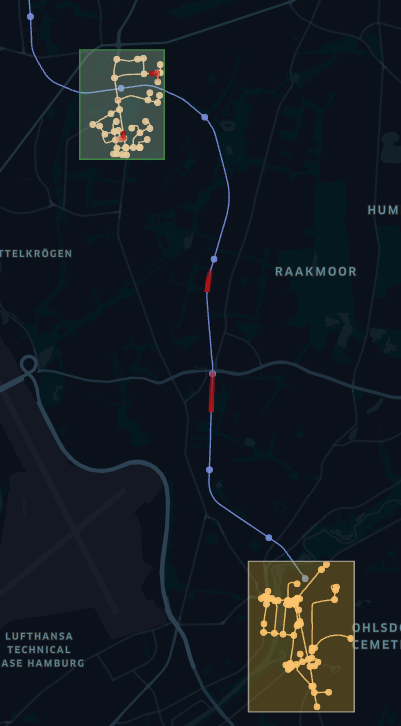
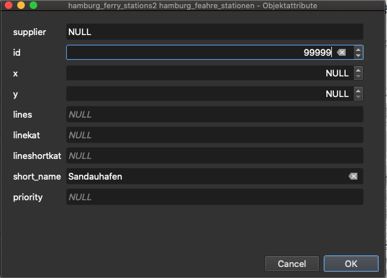

# Train transfer

The _SOHTrainBox_ scenario creates some walking agents that spawn within a specified source area a move to a specified
target area. They move within walking distance and use available train services that stop at the train stations at
regular intervals.
The default configu is shown in the following figure.



Trains move along the train line and passengers can use public sidewalks as well. Timings of trains, new or re/moved
train stations can be investigated to optimize the flow of passengers.

#### Agent Scheduling

Traveler agents can be created at runtime of the simulation and can be set with source and destination coordinates. We
use so-called agent profiles for scheduling, which represent several categories of travelers, to keep the setting of the
scenario as simple as possible.

* The ``startTime`` (including) and the ``endTime`` (exclusive) each indicate the lower and upper interval bounds in
  hours of the day. It defines the time range of the day when new agents are created in the simulation and should move
  towards a target.

* The ``spawningIntervalInMinutes`` (e.g. ``30``, for every half hour) allows to repeat the creation of new agents from
  the ``startTime``. It specifies, after how many minutes new agents should be created.

* The number of agents created can be set using the ``spawningAmount`` field (e.g. ``3`` for three new agents)

* To describe spawning location and the moving target, the scheduler offers two different parameterizations:
    * A concrete source and destination coordinate can be defined in ``WGS84:4326`` notation via the
      fields ``sourceX`` (longitude) and ``sourceY`` (latitude) for the source or ``destinationX``(longitude)
      and ``destinationY`` (latitude) for defining the movement target (e.g. ``9.95253, 53.54907``).
    * A source geometry can be defined via the ``source`` field (see polygon areas in the figure above) using
      the ``WKT`` (well-known-text) format with ``WGS84:4326`` notation. It designates areas, lines, and points in the
      simulation world (e.g.
      B. ``POLYGON((9.976880157282743 53.5447212390353,9.983403289606962 53.54446623736498,9.980656707575712 53.54240066721653,9.976880157282743 53.5447212390353))``).
      For lines and polygons (areas) the model selects **equally distributed randomly** a coordinate that either lies
      along the line or is inside the described area. A helpful tool to define own WKT vector or selecting coordinates
      is the online  [OpenLayers](http://dev.openlayers.org/examples/vector-formats.html) tool.

A full example of such a scheduling configuration is showed below and describes the setting above:

| startTime | endTime | spawningIntervalInMinutes | spawningAmount | gender | mass | perceptionInMeter | source                                                                                                                                                                                                                                                                                        | destination                                                                                                                                                                                                                                                                                                                      |
|-----------|---------|---------------------------|----------------|--------|------|-------------------|-----------------------------------------------------------------------------------------------------------------------------------------------------------------------------------------------------------------------------------------------------------------------------------------------|----------------------------------------------------------------------------------------------------------------------------------------------------------------------------------------------------------------------------------------------------------------------------------------------------------------------------------|
| 7:00      | 18:00   | 10                        | 10             | female | 60   | 1.0               | MULTIPOLYGON (((9.97859976984082 53.543765731511,9.98209851718183 53.5428480272904,9.98651496874344 53.5427906707766,9.98565462103663 53.5456584964659,9.98261472580592 53.5477233309623,9.97791149167537 53.54617470509,9.97538780506874 53.546461487659,9.97859976984082 53.543765731511))) | MULTIPOLYGON (((9.9038642323762 53.4969628162607,9.91063230100308 53.4898506085511,9.92686419440484 53.4863518612101,9.92760982908407 53.502813180667,9.92072704742962 53.5180700133344,9.90220089347638 53.5195612826928,9.89617845952873 53.5129652836073,9.89331063383937 53.498224659564,9.9038642323762 53.4969628162607))) |

Since traveler agents are simply pedestrians. Pedestrian movement can be configured additionally to affect walking and
running speed, by specifying `gender`, `mass` or the `perceptionInMeter`.

#### Train Vehicle Configuration

Trains can be parameterized by their passenger capacity (see example below or ``train.csv``). The capacity describes how
many passengers (here Traveler) can use the train at the same time. Suppose the amount of waiting passengers exceeds the
capacity. In that case, the remaining passengers have to wait for the next train to come.
Dimension properties are not part of the train model (so every train type may reach every station in comparison to the
real-world situation).
Moreover, the associated moving properties are not included because the train velocity is based on the defined
travelling time (see **Train Line Configuration**).

| type        | passengerCapacity |
|-------------|-------------------|
| HHA-Typ-DT5 | 336               |

#### Train Line Configuration

Trains can only drive on predefined train lines (routes). These lines have to be defined in the ``train_u1_line.csv`` (
see example below).
The table contains a list of stops. The column line identifies all associated stops of the same line.
The station_id identifies a train station by its id. The id is a feature property of every point geometry and can be
found in the ``hamburg_u1_north_stations.geojson``.
Minutes defines how much time is required to reach this stop from the previous one (so the train requires 3 minutes
from ``92900`` to ``92901``). The first stops minutes is 0 because it has no predecessor.

| line | station_id | minutes |
|------|------------|---------|
| U1   | 92900      | 0       |
| U1   | 92901      | 3       |
| U1   | 92902      | 3       |

#### Train Driver Configuration

To now let a train driver perform such a train drive on a define train line, the driver has to be spawned. This works
quite similar to the spawning algorithm of the **Agent Scheduling**.
Every train driver executes one line and is removed from the simulation. In the example below (also
see ``train_driver.csv``) drivers are spawned for line U1. They, therefore, move their train along the given route of
this line (see **Train Line Configuration**).
Within the given period (``startTime`` to ``endTime``) drivers are created periodically with the given
interval (``spawningIntervalInMinutes``). In providing an example starting at 5 o'clock every 10 minutes, a driver
starts to perform line U1.
The parameter ``minimumBoardingTimeInSeconds`` describes how many seconds the train will at least wait at every station
for exchange of passengers.
The parameter ``spawningAmount`` defines how many drivers start simultaneously.
The parameter ``reversedRoute`` provides the possibility to start trains in the opposite direction (the route will the
be reversed).

| line | startTime | endTime | spawningIntervalInMinutes | minimumBoardingTimeInSeconds | spawningAmount | reversedRoute 
|------|-----------|---------|---------------------------|------------------------------|----------------|---------------|
| U1   | 5:00      | 18:00   | 10                        | 20                           | 1              | false         |

#### Station Re-/placement

To adding, removing, or move train stations, two GeoJSOn files have to be modified.
Therefore open the `hamburg_u1_north_stations.geojson``-a file that contains all stations. It can either be modified
with an editor or imported in a Geographic Information System (GIS,
e.g. [QGIS](https://qgis.org/en/site/forusers/download.html)) for further modification.
In the following example, a new station is inserted using QGIS.
After importing the file mentioned above the editing, status has to be switched to editing (_yellow pen_).


Then a new point-object can be inserted at the desired position (three green points-symbol). This now requires an ID and
a short_name. Afterwards save the modified layer (save icon, see above).



The second part requires to connect the new station with the train graph. Therefore
the ``hamburg_u1_north_graph.geojson`` can be imported into QGIS. It displays the graph that connects all stations.
To get the new station to be connected, a line has to be drawn from an existing station to the new one. Beware that the
line may really click the two geo points (so zoom in to be sure).

Finally, the station can be used in a train line (see **Train Line Configuration**). Add a train line-entry and
reference the station id that was assigned.

| line   | station_id | minutes |
|--------|------------|---------|
| U1     | 80984      | 0       |
| U1     | 53988      | 7       |
| U1     | 80984      | 5       |
| **U1** | **99999**  | **3**   |

This results in train driver that commute on line U1 to also reach the new station within their trip.

---

### Using GTFS schedules

Instead of the simple manual train line description, the official commuting data in standardized GTFS format can be
used. Therefore use the **TrainGtfsRouteLayer** instead of the **TrainRouteLayer**. Modify the model description
accordingly (see below).

```
// description.AddLayer<TrainRouteLayer>(new[] {typeof(ITrainRouteLayer)});
description.AddLayer<TrainGtfsRouteLayer>(new[] {type(ITrainRouteLayer)});
```

The GTFS route layer requires different files. These are already provided in the `resources/HVV_GTFS` folder. Check the
simulation configuration for correct assignment to the new layer.


---

### Result Analyse

All relevant input files can be found in the _resources_ folder. The movement of the traveller agents are stored in
a `PassengerTraveler_trips.geojson` file. Use [kepler.gl](https://kepler.gl/#/demo) to visualize the scenarios dynamics.
